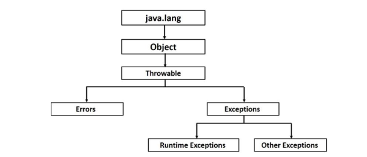

Curs 7

**Exceptii**

Exceptiile sunt evenimente care intrerup functionarea unui program

Ele deriva din clasa Trowable (este serializabila) care este super clasa pentru 
toate exceptiile si erorile din Java.

Errors :

    sunt generate de JVM, de hardware. Exemplu OutOfMemoryError. Nu pot fi anticipate

Exceptions :

    RuntimeExceptions -> 
                 exemplu ArithmeticException apare cand un intreg este impartit la zero,
                 NullPointerException cand se foloseste o instanta care este null,
                 IndexOutOfBoundsException ,
                 ArrayIndexOutOfBoundsException (un array este accesat cu un index care nu exista, subclasa a lui IndexOutOfBoundsException) 

    Alte exceptii -> IOException (apare la citirea dintr-un flux - fisier, retea),
                     FileNotFoundException (nu gaseste fisier; subclasa a lui IOException), SQLException

Exceptiile pot fi :
- definite deja in limbajul Java
- custom, definite pentru cazuri particulare

Instantierea exceptiilor -> se foloseste new 

Aruncarea exceptiilor -> se foloseste cuvantul cheie throw

**Tratarea exceptiilor**

Se poate face in doua moduri:
- se arunca exceptia adaugand throws in antetul functiei
- se foloseste blocul try/catch/finally

Sintaxa:

try{

     instructiuni

}
catch(ExceptieA a){

     ....
}

catch(ExceptieB b){

     ...
}
finally{

     ...
}

Daca pentru mai multe exceptii in catch se pune acelasi cod java, forma de mai sus se mai poate scrie si:

try{

     instructiuni

}
catch(ExceptieA a | ExceptieB b){

     ....
}
finally{

     ...
}
Variante posibile:
try/catch/finally
try/catch
try/finally

Instructiunile scrise in **finally** vor fi intotdeauna executate chiar daca in blocul principal sau in catch ul 
corespunzator exista return.

Cand sunt prise mai multe exceptii in catch, ordinea blocurilor catch este de la exceptia copil, ultima va fi parinte. 

Exemplu:

ExceptiaB extends ExceptiaA

ExceptiaC extends ExceptiaD

Parintele tuturor este Exception.

try{}

catch(ExceptioaD d){}

catch(ExceptiaC c){}

catch(ExceptiaB b){}

catch(ExceptiaA a){}

catch(Exception e){} /*Exception simplu se foloseste doar daca vrem sa prindem absolut toate exceptiile, si cele nedefinite mai sus.
      In general nu se foloseste Exception. Vor trebui prinse toate exceptiile particulare si tratate.*/

finally{}

Good practices:

Nu folositi return in finally

Nu folositi throws in finally

Exceptiile nu se ignora (adica nu continuam executia dupa ele)

**Try with resources**

Acesta a aparut dupa Java 7.

Blocul try primeste ca parametri niste clase care implementeaza interfata AutoCloseable

try(deschidere resursa){...}

catch(ExceptionX e){...}

Cand se termina blocul try/catch de executat, resursele deschise in blocul try, se vor inchide automat, adica se apeleaza automat close() pentrue ele.

Curs 8

**Serializare/Deserializare obiecte**

class A implements Serializable

Serializable este interfata marker

Serializable este utilizat pentru scriere in fisiere, transfer date pe fluxuri
Nu se serializeaza variabilele statice.

**Externalizable** -> este o interfata care extinde Serializable.

 Are metode cu format de scriere si de citire. 
 
Se pierd dependintele initiale. 

Totul trebuie definit in metodele writeExternal si readExternal.

exemplu:

ClassB implements Externalizable

! Pentru a functiona serializarea si deserializarea pentru Externalizable trebuie definit constructorul implicit. !
